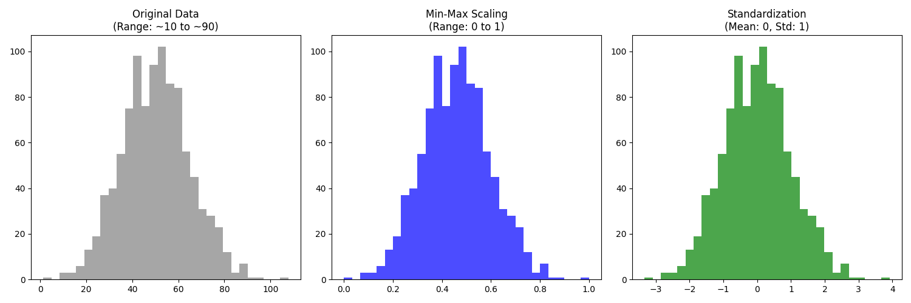

# FeatureScaler 📊


FeatureScaler is a simple Python project designed to demonstrate and visualize the effects of different feature scaling techniques, specifically **Min-Max Scaling** and **Standardization (Z-score)**.

## 📁 Project Structure

```text
FeatureScaler/
├── src/
│   ├── feature_scaler.py       # Main logic (Class & Visualization)
│   └── generate_data.py        # Script to create multi-scale test CSVs
├── data/
│   └── .gitkeep                # Directory for generated CSV datasets
├── docs/
│   └── scaler_comparison.png   # Output visualization of scaling techniques
├── requirements.txt            # Project dependencies (numpy, pandas, matplotlib)
├── .gitignore                  # Ignored files and folders
├── LICENSE                     # MIT License
└── README.md                   # Project documentation
```

## 🚀 Getting Started

### 1. Install Dependencies
Make sure you have Python installed, then install the required packages:
```bash
pip install -r requirements.txt
```

### 2. Generate Test Data
Run the data generator to create a dummy dataset with features of drastically different scales (e.g., Age vs. Square Footage):
```bash
python src/generate_data.py
```
This will create a `house_prices.csv` dataset in the `data/` folder.

### 3. Run and Visualize Scalers
Execute the main script to apply Min-Max Scaling and Standardization, which will generate a side-by-side histogram comparison:
```bash
python src/feature_scaler.py
```

## 📈 Comparing Scaling Methods

- **Original Data:** Varies depending on the natural bounds of the feature.
- **Min-Max Scaling:** Compresses data perfectly into the range `[0, 1]`. Extremely useful for Neural Networks and distance-based algorithms.
- **Standardization:** Shifts data so the `Mean = 0` and `Standard Deviation = 1` (Z-score). It does not bound data to a specific range and is robust to outliers compared to Min-Max Scaling. Commonly used for Linear Regression, Logistic Regression, and SVMs.

---

### Visualization Output


## 📄 License
This project is distributed under the [MIT License](LICENSE). Feel free to use and modify it!
